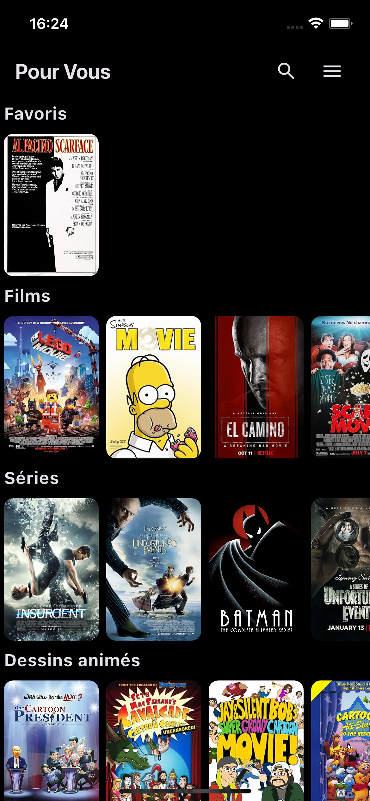

# flutter-netflix

A netflix clone app built with flutter.

## installation

Get API key from [The Movie Database](https://www.omdbapi.com/apikey.aspx) and add it to `lib/services/movies_service.dart`.
```dart
class OmdbProvider {
  final String _apiKey = 'YOUR_API_KEY';
}
```

Install dependencies
```bash
flutter pub get
```

Run the app
```bash
flutter run
```

## Features

- [x] List of movies
- [x] Movie details
- [x] Search movies

## Screenshots

|  |  |  |
|---------------------------------------------|---------------------------------------------|---------------------------------------------|

## Getting Started

This project is a starting point for a Flutter application.

A few resources to get you started if this is your first Flutter project:

- [Lab: Write your first Flutter app](https://docs.flutter.dev/get-started/codelab)
- [Cookbook: Useful Flutter samples](https://docs.flutter.dev/cookbook)

For help getting started with Flutter development, view the
[online documentation](https://docs.flutter.dev/), which offers tutorials,
samples, guidance on mobile development, and a full API reference.
